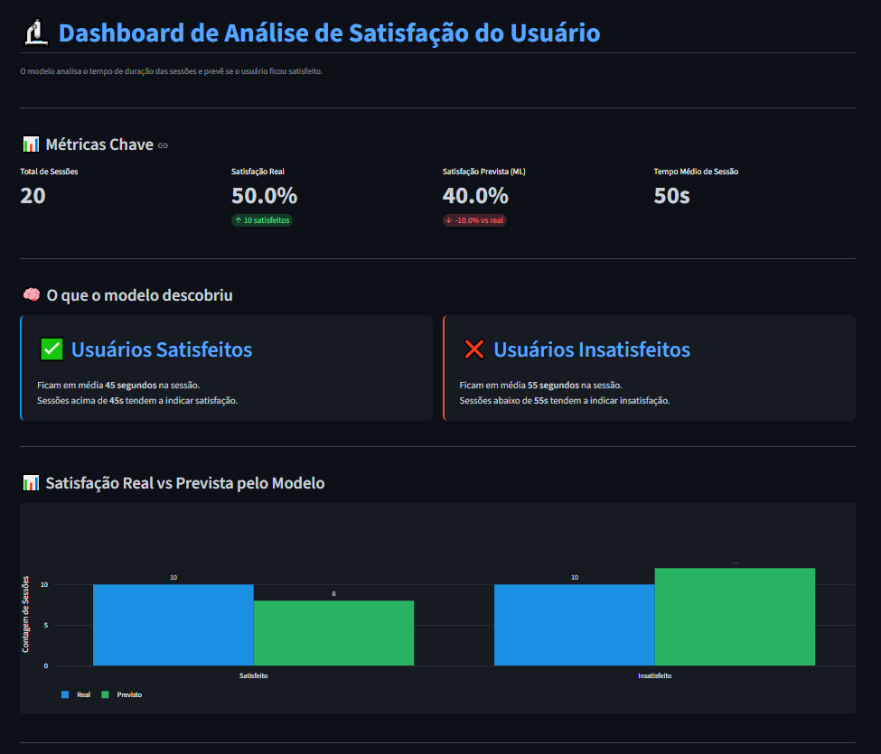
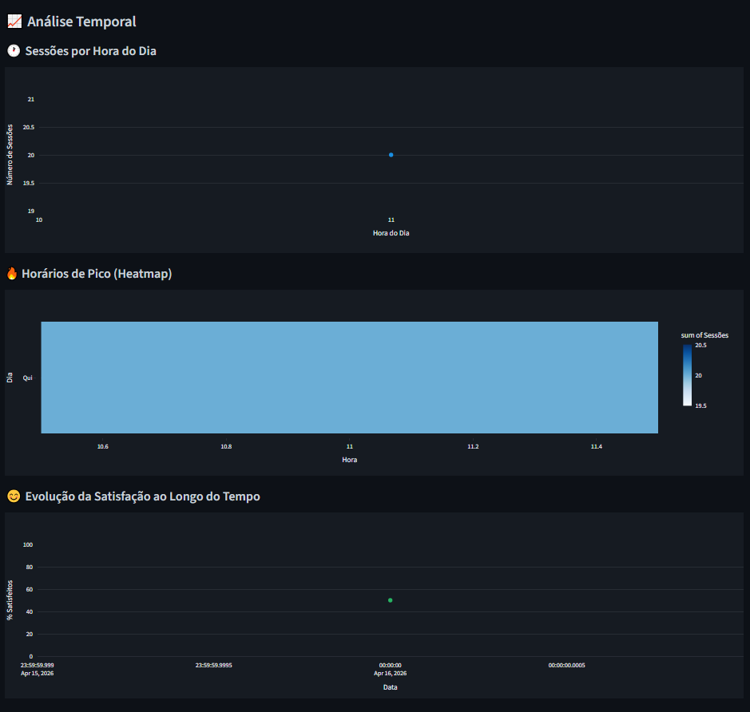
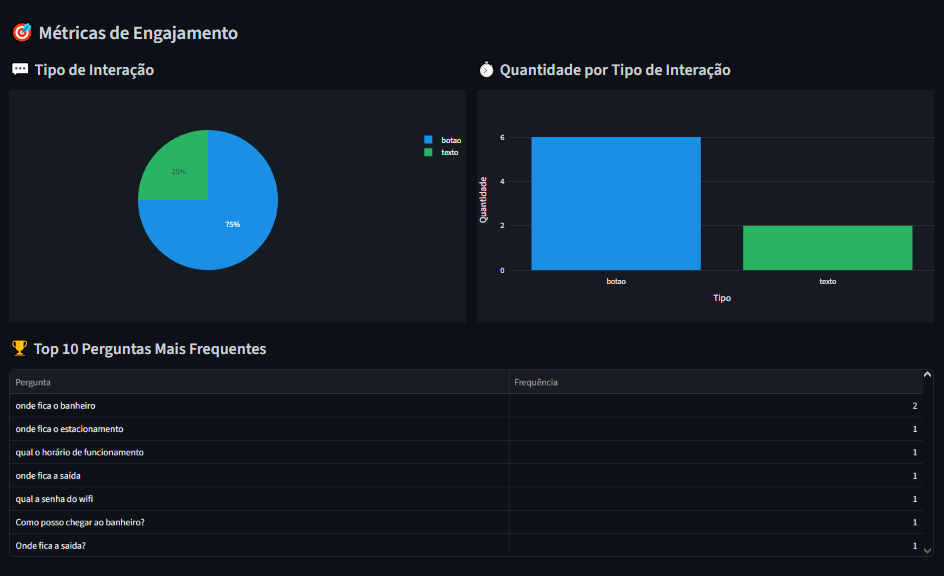

# 📊 Relatório Analítico — FlexMedia Smart-Guide

## 1. Padrões de Horário
Com base nos dados coletados pelo totem, foi possível identificar
os horários de maior movimento. O heatmap do dashboard mostra
a concentração de sessões por hora e dia da semana, permitindo
identificar os picos de uso do sistema.

## 2. Funcionalidades que Mais Engajam
A análise do tipo de interação (texto, voz e botão) mostra quais
formas de comunicação os usuários preferem. O gráfico de pizza
no dashboard exibe essa distribuição de forma clara.

## 3. Correlação entre Tempo de Sessão e Satisfação
O modelo de Machine Learning identificou que usuários que ficam
mais tempo na sessão tendem a ser classificados como satisfeitos.
Sessões muito curtas geralmente indicam insatisfação ou dificuldade
de uso.

## 4. Insights Principais
- Usuários satisfeitos ficam em média mais tempo na sessão
- Horários de pico concentram-se nos períodos da manhã e tarde
- A interação por texto é a mais utilizada

## 5. Prints do Dashboard

